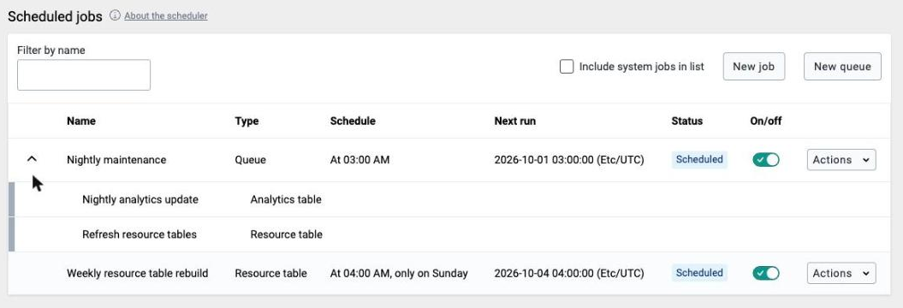
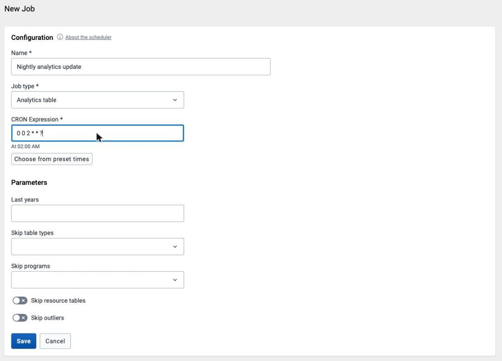
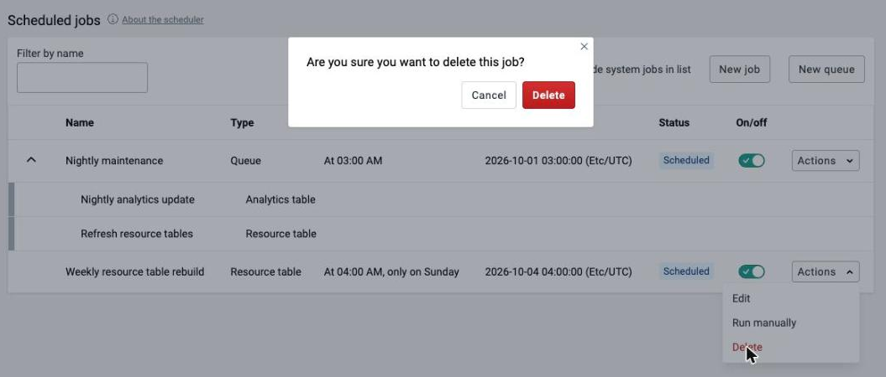
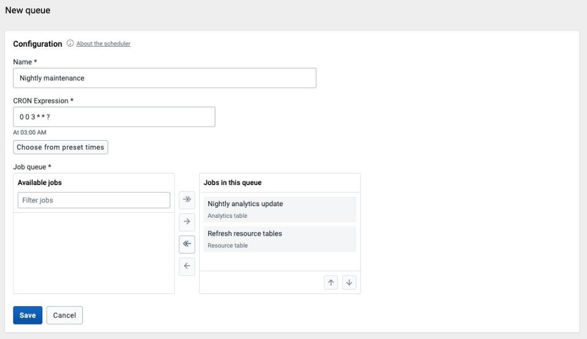
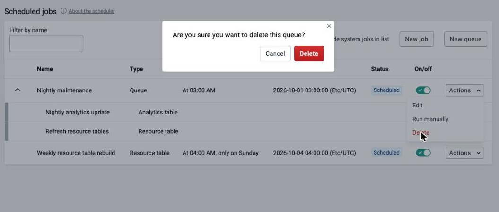

# Scheduler { #scheduler }

The Scheduler is an application for managing background jobs in DHIS2.
Background jobs can do many tasks, such as running analytics, synchronizing data
and metadata, or sending a push analysis report. In the application you can
create, modify, and delete such jobs.

You can run jobs in a specific order with a job queue. A job queue consists of
two or more jobs, and you can schedule it with a cron schedule. At the specified
time, the queue starts the first job and waits for it to finish before it starts
the second job. It continues running jobs in sequence until all of them have
run.

The Scheduler comes bundled with DHIS2. You open it from the App Menu.

The start page of the Scheduler app shows an overview of existing jobs and
queues. By default, the app hides pre-defined system jobs. To view them, click
_Include system jobs in list_ in the top right corner.

When you create or modify a job or queue, DHIS2 schedules it according to the
selected schedule. To run a job or queue on demand, go to the overview, click
the "Actions" button of the job or queue you want to run, and click "Run
manually". This action is only available for enabled jobs and queues.

## Creating a job { #scheduling_create_job }

1.  Open the **Scheduler** app and click the "New job" button in the top right
    corner.

1.  Enter a **Name** for the new job.

1.  Select the **Job type** you want to schedule using the menu.

1.  Select a schedule for the job. Each job type has its own scheduling type,
    either **Cron** scheduling or **Delay** scheduling.

    1.  For **Cron** scheduled job types, you can set a schedule using the
        [Spring
        scheduling](https://docs.spring.io/spring/docs/current/javadoc-api/org/springframework/scheduling/support/CronExpression.html)
        syntax. You can also select a predefined **Cron expression** by clicking
        "Choose from preset times". This schedule only starts a new job run if
        the previous job run has finished. This prevents the system from
        starting too many jobs.

    1.  For **Delay** scheduled jobs, you can set a delay in seconds. Unlike
        **Cron** scheduled jobs, these jobs do not run on a set schedule. They
        run with a specific delay between job runs. This continues as long as
        the job is enabled.

1.  If the job type is customizable, a **Parameters** section appears below the
    scheduling settings. These additional options set the details of the
    scheduled job. They vary depending on the job type.

1.  Click the **Save** button to confirm the job creation. When the job is
    created, DHIS2 opens the job overview, where the new job is listed.

Newly created jobs are enabled by default.

## Editing a job { #scheduling_configure_job }

With the proper permissions, you can modify the details of user-created jobs. To enable or disable a user-created job, use the switches in the **On/off**
column on the landing page of the Scheduler app. System jobs are always enabled
and cannot be disabled.

To edit other details of a user job:

1.  Click the "Actions" button of the job you want to edit and click "Edit" (you
    can edit only user jobs).

1.  When you finish editing, click the **Save** button to save the changes.

## Deleting a job { #dataAdmin_scheduler_delete }

1.  Click the "Actions" button of the job you want to delete and click "Delete"
    (you can delete only user jobs).

1.  Confirm by clicking **Delete** again in the pop-up window.

You can also delete user jobs from the editing screen.

## Job types

This section describes the job types.

### Disable inactive users { #scheduling_disable_inactive_users }

DHIS2 can automatically disable users that have not been active (not logged in)
for a specified number of months. Select the number of inactive months as the job
parameter. The job disables all users that have not logged in for that number of
months or longer. Disabled users cannot log in to the system.

Use the _Reminder days before_ parameter to send a reminder email to those users
the specified number of days before their account is due to expire. If users do
not log in, DHIS2 sends further reminder emails, each at half the previous
number of days. For example, if the number of days is set to 7, the first email
is sent 7 days in advance, the second 3 days in advance, and the third and last
1 day in advance. If the value is not set (blank), no reminder is sent.

### Resource table { #scheduling_resource_table }

The resource table job generates and updates the resource database tables.
Various components in DHIS2 use these tables. They are meant to simplify queries
against the database.

When you include any of the analytics table jobs, resource tables can be part of
the process. You do not need to also include a resource table job.

### Analytics table { #scheduling_analytics_table }

The analytics tables job generates and updates the analytics tables. DHIS2 uses
the analytics tables as the basis for data analytics queries. Apps such as
dashboard, visualizer, and maps retrieve data from these tables through the
DHIS2 analytics API. The tables must be updated for analytics data to become
available. You can schedule this process to run regularly through an analytics
table job type.

By default, the analytics table job populates data for all years and data
elements. The following parameters are available:

-   **Last years:** The number of last years to populate analytics tables for.
    For example, if you set 2 years, the process updates the last two years'
    worth of data and does not update older data. This parameter reduces the
    time the process takes to complete. Use it if older data has not changed and
    you want to update only the latest data.
-   **Skip resource tables:** Skip resource tables during the analytics table
    update process. This reduces the time the process takes to complete, but
    changes in metadata are not reflected in the analytics data.
-   **Skip table types:** Skip one or more analytics table types. This reduces
    the time the process takes to complete, but those data types are not updated
    in the analytics data.

### Continuous analytics table { #scheduling_continuous_analytics_table }

The analytics tables job generates and updates the analytics tables. DHIS2 uses
the analytics tables as the basis for data analytics queries. Apps such as
dashboard, visualizer, and maps retrieve data from these tables through the
DHIS2 analytics API. The tables must be updated for analytics data to become
available. You can schedule this process to run regularly through an analytics
table job type.

The continuous analytics table job is based on two phases:

-   _Latest update:_ Update of the latest data. The latest data is the data that
    has been added, updated, or removed since the last time the latest data or
    the full data was updated. This process happens frequently.
-   _Full update:_ Update of all data across all years. This process happens
    once per day.

The continuous analytics table job frequently updates the latest data. The
latest data process uses a special database partition that holds the latest data
only. This partition can be refreshed quickly because it holds a relatively
small amount of data. The partition grows in size until a full update runs. Once
per day, DHIS2 updates all data for all years. This clears out the latest
partition.

By default, the analytics table job populates data for all years and data
elements. The following parameters are available:

-   **Full update hour of day:** The hour of the day at which the full update
    runs. For example, if you set 1, the full update runs at 1 AM.
-   **Skip table types:** Skip one or more analytics table types. This reduces
    the time the process takes to complete, but those data types are not updated
    in the analytics data.

### Tracker trigram index maintenance { #scheduling_tracker_index_maintenance }

The tracker trigram index maintenance job creates and updates partial trigram
indexes for relevant tracked entity attributes on the
`trackedentityattributevalue` table. These partial trigram indexes significantly
improve the performance of searches on tracked entities.

A partial trigram index is created for a tracked entity attribute on the `trackedentityattributevalue` table if both of the
following conditions are met:

-   The tracked entity attribute has the flag `trigramindexable` set to true.
-   The tracked entity attribute allows the use of at least one of the following
    operators: `LIKE` or `EW`.

The job also removes obsolete partial trigram indexes that were previously
created but have since become unnecessary because one or both of these
conditions are no longer satisfied.

A trigram index only takes effect if the searched text is at least 3 characters long.
For this reason, DHIS2 recommends that you configure the tracked entity
attribute intended for trigram indexing with a minimum search length of 3
characters. You can set this using the property `minCharactersToSearch`.

The job accepts one parameter: `runAnalyze`.
This is a boolean flag. When set to true, the job runs an `ANALYZE` command on
the `trackedentityattributevalue` table.
Running `ANALYZE` updates PostgreSQL column statistics. This lets the query
planner decide accurately when to use the trigram index for optimal query
performance.

#### Version 2.42 and earlier

This job was called **Tracker search optimization**, and worked differently: instead of automatic inclusion by flag, you chose which attributes to index directly.

-   **Attributes:** The list of attributes that need a trigram index. DHIS2 creates a partial trigram index for each attribute. For example, if you enter the attributes "firstname" and "lastname", the process creates two separate trigram indexes, one for each attribute. If an attribute in this parameter is not indexable (either because it is not unique or because it is not searchable), the process ignores it and creates no trigram index for it.
-   **Skip index deletion:** Skip obsolete index deletion during the trigram index process. If set to true, indexes that are deemed obsolete are not deleted.

### Data synchronization { #scheduling_data_sync }

DHIS2 provides synchronization of data between remotely distributed instances
and a central instance of DHIS2. This can be useful, for example, when you have
deployed multiple stand-alone instances of DHIS2 that are required to submit
data values to a central DHIS2 instance. DHIS2 supports synchronization of both
tracker data and aggregate data.

These are the steps to enable data synchronization:

-   Go to Synchronization Settings, and enter the remote server URL, username,
    and password. Press the TAB button to save the new password automatically.
    Refresh the page and check that the filled values are still present. The
    password field is empty after the refresh because this value is encrypted,
    so you can consider it saved.

-   In the Scheduler app, create a new job with the "Single events data
    synchronization" job type, the "Tracked entities data synchronization" job
    type, or both. Make sure the job is enabled when you finish.

Be aware of these aspects of the data synchronization feature:

-   The local DHIS2 instance stores the password of the user account on the
    remote instance, encrypted, in the local database. DHIS2 uses the remote
    account for authentication when transferring data. For security, make sure
    you set the _encryption.password_ configuration parameter in
    _hibernate.properties_ to a strong password.

-   DHIS2 strongly recommends that you deploy the remote server on SSL/HTTPS.
    The username and password are sent in clear text using basic authentication,
    so an attacker could intercept them.

-   Data synchronization uses the UID property of data elements, category option
    combos, and organisation units to match the metadata. For this reason,
    synchronization only works correctly if these three metadata objects are
    harmonized on the local and remote instances.

-   The first time DHIS2 runs the synchronization job, it includes any data
    available. Later synchronization jobs include only data added and changed
    since the last successful job. A synchronization job is considered
    successful only if all the data was saved successfully on the remote server.
    (Any data successfully synced remains on the receiving instance, even if the
    job fails later.) You can tell whether the job was successful from the
    import summary returned from the central server.

-   The initial synchronization job can take a significant amount of time and
    can slow down your instance, depending on how much data is synchronized.
    Consider configuring the job to run when few users are online, then change
    this later to your own preference. If you do not want or need to synchronize
    all the data, you can <a href="#skip_changed_before">skip some of the data
    being synchronized</a>.

    When DHIS2 synchronizes tracker data, it determines the set of data to
    synchronize based on the last time it was synchronized. Each tracked entity
    instance and event has its own record of when it was last successfully
    synchronized.

-   The system starts a synchronization job based on the rules set in the
    configuration of the job. If the synchronization job starts while there is
    no connection to the remote server, it checks the connection up to three
    times before it aborts. The job runs again at a scheduled time.

-   DHIS2 does not synchronize the attributes of TrackedEntityInstances
    (TrackedEntityAttribute) and the data elements of ProgramStages
    (ProgramStageDataElement) that have the option "Skip synchronization" turned
    on. With this feature, you can choose not to synchronize data that is
    sensitive or not relevant, and keep it only locally.

-   In specific cases, **the initial
    synchronization of all the data can be undesirable**. This is the case, for
    example, when the database on the local instance is a fresh copy of the
    database on the central instance. It is also the case when you prefer not to
    synchronize old data so that the initial synchronization takes less time.

    Use the _syncSkipSyncForDataChangedBefore_ SettingKey to skip the
    synchronization of all the data (data values, Event and Tracker program
    data, complete data set registrations) that was _last changed before the
    specified date_. The synchronization job always uses the `SettingKey`.
    Therefore, if you need to synchronize the old data, you should change the
    `SettingKey`.

-   Both the "Single events data synchronization" and "Tracked entities data
    synchronization" jobs support paging to avoid timeouts and to deal with an
    unstable network. The default page size for both jobs is 60.

    If the default value does not fit your purpose, you can set your own
    page size with the parameter in the sync job in the Scheduler app. The
    allowed page size ranges from a minimum of 5 to a maximum of 200.

#### Version 2.41 and earlier

These jobs were called **"Event Programs Data Sync"** and **"Tracker Programs Data Sync"**. Default page size was 60 for the event job, but only 20 for the tracker job, and the allowed range was narrower for the tracker job (5–100, versus 5–200 for the event job). In 2.42.0 to 2.42.4.1, the Scheduler app cannot create either of these jobs or their replacements. From 2.42.5, the jobs are available as **Single events data synchronization** and **Tracked entities data synchronization**.

In 2.41 and earlier, the following guidance applied to the "Skip synchronization" option above. It does not apply to 2.42 and later, where the authority no longer exists.

> The authority `Ignore validation of required fields in Tracker and Event Capture` (`F_IGNORE_TRACKER_REQUIRED_VALUE_VALIDATION`) should be used when there is a requirement that some mandatory attribute / data element has at the same time a "Skip synchronization" property turned on. Such a setting will lead to validation failure on the central server as the given attribute / data element will not be present in the payload.
>
> The validation will not fail for the user with this authority. The authority should be assigned to the user, on the central server, that will be used for synchronization job.

### Metadata synchronization scheduling { #scheduling_metadata_sync }

DHIS2 provides a feature for synchronizing metadata from a remote instance to a
local instance of DHIS2. This can be useful when you have deployed multiple
stand-alone instances of DHIS2. In that case, you need to create metadata in all
the local instances that is similar to the metadata on the central DHIS2
instance.

These are the steps to enable metadata synchronization:

-   Go to Settings \> Synchronization, enter the remote server URL, username,
    and password, and click Save.

-   In the Scheduler app, create a new job with the "Metadata synchronization" job type.

Be aware of these aspects of the metadata synchronization feature:

-   The local DHIS2 instance stores the password of the user account of the
    remote instance in its database. DHIS2 uses the remote user account for
    authentication when transferring or downloading data. For security, make
    sure you set the _encryption.password_ configuration parameter in
    _hibernate.properties_ to a strong password.

-   DHIS2 strongly recommends that you deploy the remote server on SSL/HTTPS.
    The username and password are sent in clear text using basic authentication,
    so an attacker could intercept them.

-   Also make sure that the remote user does not have the ALL authority.
    Instead, create a user with the F_METADATA_MANAGE authority, so that even if
    an attacker intercepts these details, they cannot gain full control of the
    remote system.

-   Metadata synchronization relies on the underlying import layer. Each
    metadata version is an export of metadata between two given timestamps. Each
    sync of a metadata version is an attempt to import that metadata snapshot
    into the local instance. The sync of versions is incremental. The local
    instance tries to download the metadata versions from the central instance
    one after the other. If a specific metadata version fails to sync, the sync
    does not proceed to later versions. If a sync fails, you must make the
    appropriate changes to the metadata on the central instance so that the
    error is resolved. Metadata configuration is critical, so be careful when
    you roll out updates to production. It is always recommended to have staging
    environments in place, to check the metadata versions and their effects. The
    local instance syncs the metadata from the first version so that the local
    and central instances stay consistent and work correctly.

-   The system attempts a synchronization at the scheduled time. If the local or
    remote server does not have a working Internet connection at that time, the
    synchronization is aborted and attempted again according to the retry count
    in the _dhis.conf_ file.

-   You can see the time of the last run of the job in the job details in the
    Scheduler app.

### Predictor { #scheduling_predictor }

This job runs selected predictors, predictor groups, or both.

The relative start and end parameters determine the periods in which data is
predicted, relative to the date on which the predictor job runs:

-   **Relative start** counts the days from the job date to the earliest date on
    which a predicted period can start. It can be positive or negative. For
    example, a value of 3 means predict into periods that start at least 3 days
    after the predictor run. A value of -3 means predict into periods that start
    at least 3 days before the predictor run.

-   **Relative end** counts the days from the job date to the latest date on
    which a predicted period can end. It can be positive or negative. For example, a
    value of 9 means predict into periods that end at least 9 days after the
    predictor run. A value of -9 means predict into periods that end at least 9
    days before the predictor run.

Setting these values gives you control over when predictions are made,
especially if your predictor job is set to run daily or more frequently. Before
you set these values, think carefully about when you want predictions for a
period to start and when you want them to stop. Then compute the appropriate
relative start and end dates.

Examples:

1.  **Requirement**: A predictor uses data from the same week as the predicted
    value. (No past sampled data are used.) After the week ends on Sunday, you
    expect the data to be entered in the following two days (Monday and
    Tuesday). You do not want to start predicting data until Wednesday after the
    week ends, because you do not want partial results to be shown. However,
    data might still be adjusted on Wednesday, so you want to update the
    predictions on Thursday also. After that, the data are frozen and you do not
    want to predict for that period anymore.

        **Solution:** For a job running daily or more frequently, define the
        relative start as -10 and the relative end as -2 (for periods
        within 10 to 2 days before the job runs).

        - Before Wednesday of the following week, the period end is
        greater than 2 days before, so no predictions are made.

        - On Wednesday of the following week, the period started 9 days
        before and ended 2 days before. Predictions are made because -9 to -2
        are within the range -10 to -2.

        - On Thursday of the following week, the period started 10 days
        before and ended 3 days before. Predictions are made because -10 to -3
        are within the range -10 to -2.

        - After Thursday, the previous week started more than
        10 days before, so no predictions are made.

        - Predictions are made only on Wednesday and Thursday. On Friday through
        Tuesday, no predictions are made (and the job finishes very quickly).

2.  **Requirement**: A predictor forecasts a limit (average plus twice the
    standard deviation) for expected non-seasonally varying disease cases based
    on data from the previous five weeks. Weeks are Monday through Sunday.
    Predictions should start on the previous Tuesday, using the data available
    at that time. They should continue through Tuesday of the week that the
    predictions are for. By then, the previous week's data are assumed to be
    final.

        **Solution:** For a job running daily or more frequently,
        define the relative start as -1 and the relative end as 12.

        - Before Tuesday, predictions are not made for the following week
        because it ends more than 12 days later.

        - On Tuesday, predictions are made for the following week, which starts
        in 6 days and ends in 12 days.

        - On Wednesday through the following Tuesday, predictions are made for
        the week whose start-to-end dates are Wed: 5 to 11, Thu: 4 to 10,
        Fri: 3 to 9, Sat: 2 to 8, Sun: 1 to 7, Mon: 0 to 6, and Tue: -1 to 5.

        - On Tuesday, predictions are made for the current week with
        start-to-end dates -1 to 5, and also for the following week
        with start-to-end dates 6 to 12. On all other days of the week
        predictions are made for one week.

You can select which predictors and predictor groups run during the job:

-   **Predictors** runs individual predictors. They run in the order added.

-   **Predictor groups** runs predictor groups. They run in the order added. The
    predictors within each group run in the order of their names (comparing
    Unicode character values).

If both individual predictors and predictor groups are selected in the same job,
the individual predictors run first, followed by the predictor groups.

### Data integrity { #scheduling_data_integrity }

The Data integrity job type schedules data integrity checks. DHIS2 can perform a wide range of data integrity checks on the data in the database. Identifying and correcting data integrity issues is extremely important to ensure that the data used for analysis is valid. Each data integrity check that the system performs is described, along with general procedures to resolve these issues.

You can view the result of the data integrity checks in the Data Administration app. The result is only available for up to _one hour_ after the job has completed.

Some data integrity checks are marked as _slow_. Be cautious about running these checks on production systems, because they can reduce performance. It is generally not recommended to run more than one of them at the same time.

The following parameters are available:

-   **Report type** the level of specificity of the result. The available options are:
    -   **Summary** - a summary of the number of issues is available.
    -   **Details** - a list of issues pointing to individual data integrity violations is available for each integrity check.
-   **Checks to run** sets the data integrity checks to run. If you select _Only run selected checks_, DHIS2 shows a list of checks, and you can select the checks to run. If you select _Run all standard checks_, DHIS2 runs all _standard_ checks. This does not run checks that are marked as _slow_. You must select these checks manually using _Only run selected checks_.

See [Data Administration](data-administration.html#data_admin_data_integrity) for more information about the available data integrity checks.

## Schedule queues { #schedule_queues }

### Creating a queue { #scheduling_create_queue }

1.  Open the **Scheduler** app and click the "New queue" button in the top right
    corner.

1.  Enter a **Name** for the new queue.

1.  Select a cron schedule for the queue. You can schedule queues using the
    [Spring scheduling](https://docs.spring.io/spring/docs/current/javadoc-api/org/springframework/scheduling/support/CronExpression.html)
    syntax, like jobs. You can also select a predefined **Cron expression**
    by clicking "Choose from preset times".

1.  Select the jobs that should be part of the queue. Add the available jobs to
    the queue with the arrow buttons. The queue runs the jobs in the order
    specified here. If a job in the queue fails or is canceled, the
    remaining jobs in the queue are skipped.

1.  Click the **Save** button to confirm the queue creation. When the queue is
    created, DHIS2 opens the jobs and queue overview, where the new queue is
    listed. The queue has a menu arrow. Click it to show the jobs that are
    part of the queue.

Newly created queues are enabled by default.

### Editing a queue { #scheduling_configure_queue }

With the proper permissions, you can modify the details of queues. To enable or disable a queue from running, use the switches in the **On/off**
column on the landing page of the Scheduler app.

To edit other details of a queue:

1.  Click the "Actions" button of the queue you want to edit and click "Edit".

1.  When you finish editing, click the **Save** button to save the changes.

1.  If you removed jobs from the queue, the overview shows them again. Because
    they were part of a queue, they are disabled and have no schedule.

### Deleting a queue { #scheduling_delete_queue }

1.  Click the "Actions" button of the queue you want to delete and click
    "Delete".

1.  Confirm by clicking **Delete** again in the pop-up window.

1.  The overview shows all jobs that were part of the queue again. Because they
    were part of a queue, they are disabled and have no schedule.

You can also delete queues from the editing screen.

